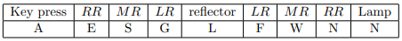

# Simplified Enigma Machine in Haskell #

## About this Project ##

This project conforms to an assignment brief provided by a professor at my univcerssity. It aims to simulate three aspects related to the Enigma machine and the efforts from the code breakers working at Bletchley Park:
1. The Enigma machine
2. Finding the longest menu
3. The Bombe machine

All of the code can be found in the `Enigma.hs` file and it is separated into the different sections outlined above by clear comment breaks. Each function has a concise descrription outlining its parameters and purpose directly above itself.

## The Enigma Machine ##

My implementation design is a simplified version of the real machine as it does not include double-stepping which I will now give a brief outline of.
The Enigma machine was an encryption/decryption device that was built upon rotors where each rotor contained a fixed alphabetic substitution cypher. Below is a list of the pre-defined rotors I used for this project, along with their notch positions:
* plain - ABCDEFGHIJKLMNOPQRSTUVWXYZ
* R1 - EKMFLGDQVZNTOWYHXUSPAIBRCJ, 17
* R2 - AJDKSIRUXBLHWTMCQGZNPYFVOE, 5
* R3 - BDFHJLCPRTXVZNYEIWGAKMUSQO, 22
* R4 - ESOVPZJAYQUIRHXLNFTGKDCMWB, 10
* R5 - VZBRGITYUPSDNHLXAWMJQOFECK, 0

With these rotors, if you input 'A' which is position 0 in plain text through R3, you would get 'B'. Each rotor can also be offset by an integer in the range 0 - 25, for example if we had the same input as before but R3 now has an offset of 2, the output would instead be 'F'. The Enigma machine consisted of three rotors: the left rotor `(LR)`, the middle rotor `(MR)`, and the right rotor `(RR)`. Each day, the machine was also initialised with a set of corresponding offsets `(OL, OM, OR)`; to simplify this project I have made the assumption that the initial conditions were reset for each message, though in reality it was much more complicated.

For each character in the message, the `RR`'s offset is increased by 1 (or returned to 0 if it reaches 26). When it reaches its notch position, the `MR` will also have its offset increased, and the same applies to the `LR` when the `MR` reaches its own notch position. My rotors advance when the notch position is reached, so if your `OR` is 3 and the notch position of `RR` is 5, then `OM` will be increased after two characters. The real Enigma machine has a system known as `Double-Stepping` which can make `OM` increase its offset by 2 in a single character under a specific set of conditions; this is something I have not included in my program. It is important to note that the offsets are increased before the character is encoded.

### Basic Enigma ###
In the basic (unsteckered) Enigma, an input character will be passed through the RR, MR, LR in that order. It will then be transmitted through a reflector (a fixed character-swap) before being passed back through the rotors in reverse order (LR, MR, RR). The standard pairings for the reflector were:
`(A Y) (B R) (C U) (D H) (E Q) (F S) (G L) (I P) (J X) (K N) (M O) (T Z) (V W)`

An example, where R1, R2, R3 correspond to LR, MR, RR and our initial offsets are (0, 0, 25). Before encoding, OR will be incremented making the offsets (0, 0, 0):

### Steckered Enigma ###
This is a more complex version of the basic enigma, where the reflector is replaced by a stecker. A stecker was created by matching pairs of letters through a plugboard, with up to 10 pairings. The letters that were not paired would remain unchanged.

